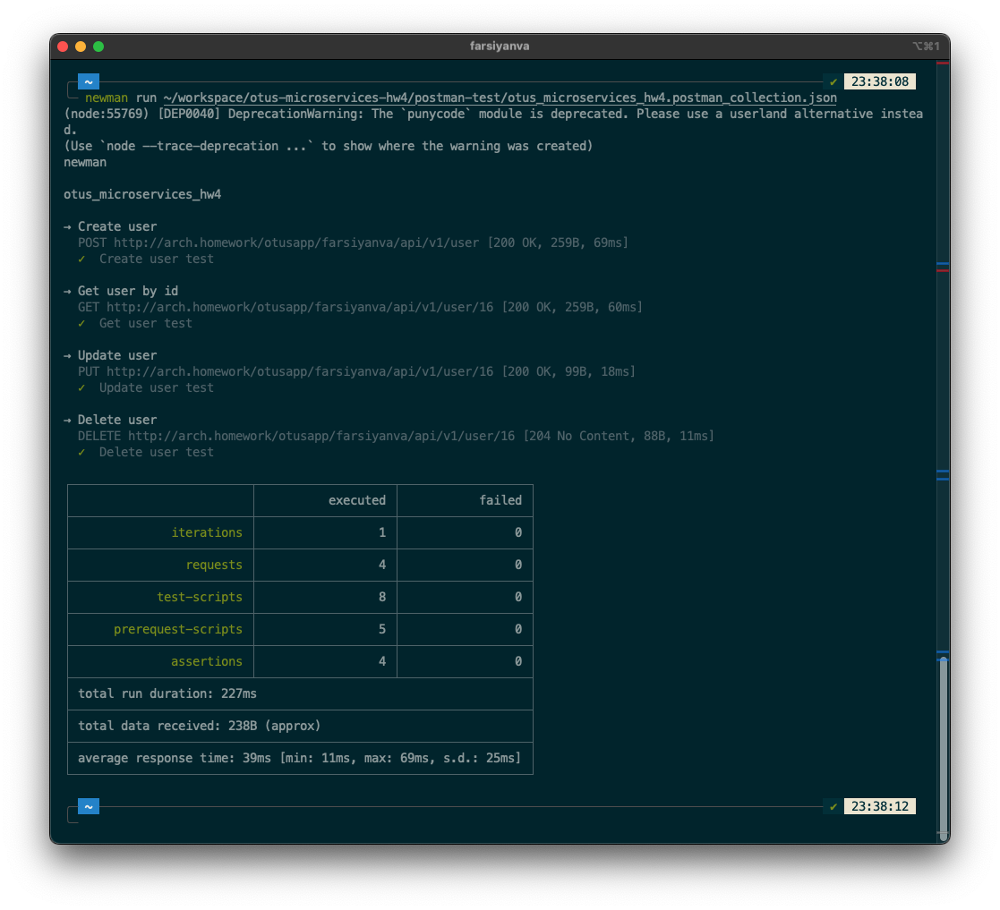

### Инструкции

- команда установки приложения из _Helm_
```console
helm upgrade --install -n <namespace> <release> ./crud-chart

``` 
<br>

- команда запуска тестов _Postman_ с помощью _newman_
```console
newman run ./postman-test/otus_microservices_hw4.postman_collection.json

```
<br>

- результат запуска тестов с помощью _newman_ \

